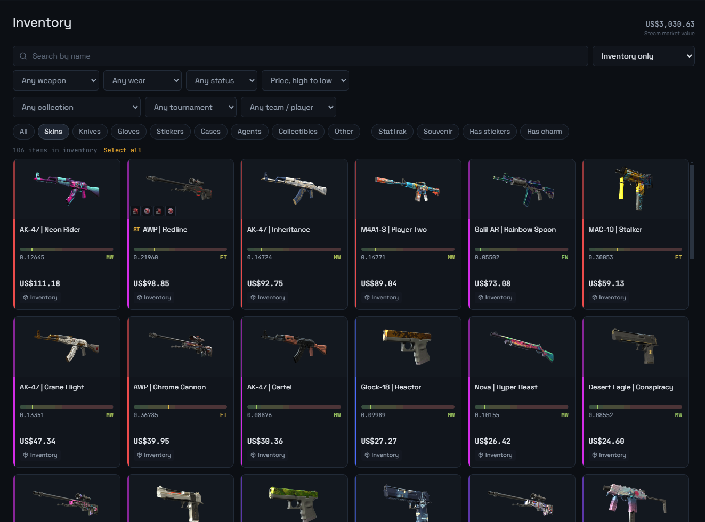
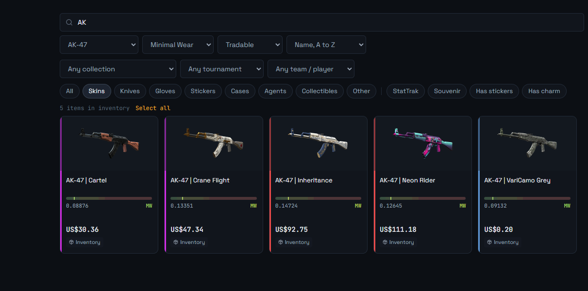
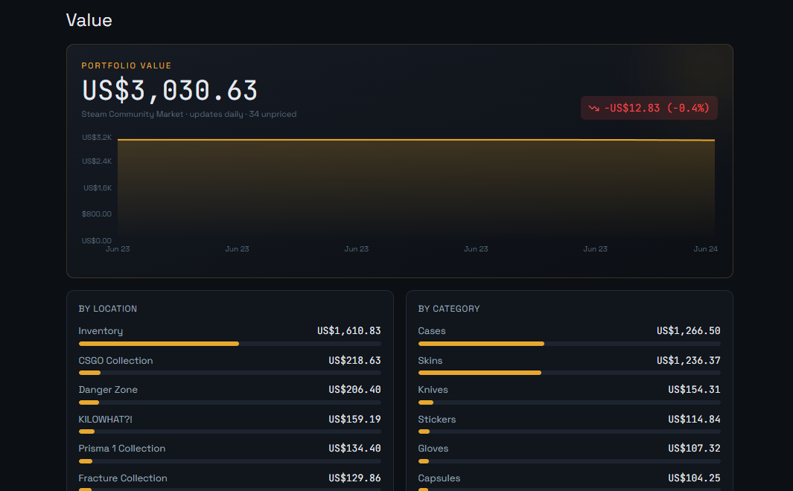
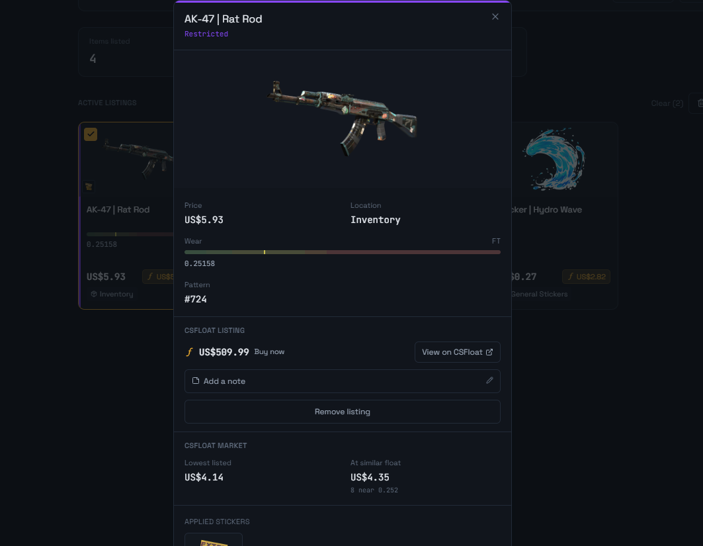
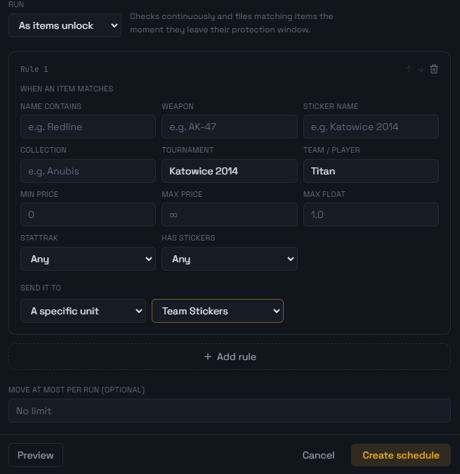

<div align="center">


# caskt

**Manage. Track. Collect.**

The inventory manager for serious CS2 collectors. Search everything you own, track what it's worth, move items in bulk, and list on CSFloat without leaving the app. Storage units included.

<br />

[](https://discord.gg/kKv6WM8NDt)


<br />

[**Download**](https://github.com/0xRetroDev/caskt/releases/latest) · [Discord](https://discord.gg/kKv6WM8NDt) · [Report a bug](https://github.com/0xRetroDev/caskt/issues) · [Request a feature](https://github.com/0xRetroDev/caskt/issues)

<br />



</div>

---

## Why Caskt

Steam's inventory was never built for collectors. Once you pass a few hundred items and start using storage units, you are opening boxes one at a time, with no search, no sorting, and no idea what any of it is worth. Selling means a browser, prices pasted by hand, one skin at a time.

Caskt puts your entire collection, every storage unit included, into one fast desktop app, and adds the tools Steam never shipped: live valuation, bulk moves, scheduling, and CSFloat listing. It runs on your machine, signs in with Steam and nothing else, and is open source from top to bottom.

## Features

**One searchable grid.** Loose items and every storage unit, merged into a single view. Filter and sort by weapon, wear, float, StatTrak, stickers, charms and price, and find an AWP under 0.07 float in seconds.

**Live valuation.** Prices your collection against the Steam Community Market, charted over time and broken down by storage unit and category. Multi-currency.

**CSFloat built in.** Connect your CSFloat key for live market prices on every item, float-aware pricing, and bulk list or delist, with withdrawals handled for you. No browser tabs, no pasting prices one skin at a time.

**Bulk moves, safely.** Select hundreds of items and send them in and out of storage in one paced, trade-lock-aware job that runs in the background while you keep browsing.

**Automation.** Set a rule once and let Caskt move items the moment they come off trade lock, on an interval, or by your own filters. It pauses while you are in a game and picks up right after.

**Discord notifications.** Optional rich summaries when a move, listing or withdrawal finishes: how many items, where they went, the names and the combined value.

## Screenshots

<table>
  <tr>
    <td width="50%"><br /><sub>The inventory grid, fully searchable</sub></td>
    <td width="50%"><br /><sub>Portfolio value, tracked over time</sub></td>
  </tr>
  <tr>
    <td><br /><sub>Live prices and your CSFloat listings</sub></td>
    <td><br /><sub>Moves that run on a schedule</sub></td>
  </tr>
</table>

## Download

Grab the latest installer for your platform from the [Releases page](https://github.com/0xRetroDev/caskt/releases/latest):

| Platform | File |
| --- | --- |
| Windows | `Caskt-Setup-*.exe` |
| macOS | `Caskt-*.dmg` |
| Linux | `Caskt-*.AppImage` or `*.deb` |

Caskt updates itself, so once it is installed new releases arrive automatically.

## Build from source

Requirements: [Node 20+](https://nodejs.org) and a Steam account.

```bash
git clone https://github.com/0xRetroDev/caskt
cd caskt

npm run setup   # install the server, ui and desktop dependencies
npm run dev     # build the server and UI, then launch the app
```

To produce installers for your current platform:

```bash
npm run build   # output lands in desktop/out
```

## How it works

Caskt is an Electron app in a small monorepo:

- **`server/`** — Node and TypeScript. Reads your inventory through Steam's Game Coordinator (the only way to see inside storage units), stores everything in a local SQLite database, and pulls prices from the Steam market and, optionally, CSFloat.
- **`ui/`** — React, Vite, Tailwind and TanStack Query.
- **`desktop/`** — the Electron shell that bundles both and handles auto-updates.

Your inventory is read through your own Steam session and is held in a database on your own machine.

## Privacy

Caskt is local-first. It talks only to Steam, and to CSFloat if you choose to connect it. There is no Caskt account and no cloud copy of your inventory. Everything lives on your computer, and because the whole app is open source you can read exactly what it does and build it yourself.

## Tech stack

`Electron` · `Node` · `TypeScript` · `React` · `Vite` · `Tailwind` · `TanStack Query` · `SQLite` · `better-sqlite3`

## Community

Questions, feedback, or want to follow along? [Join the Discord](https://discord.gg/kKv6WM8NDt).

## Contributing

Issues and pull requests are welcome. If you are reporting a bug, a screenshot and the relevant lines from the log file (available from the tray menu) go a long way.

## License

[MIT](LICENSE). Use it, fork it, ship it.

---

<div align="center">

Caskt is an independent project and is not affiliated with Valve or Steam.

Built by [0xRetroDev](https://0xretro.dev) · [@0xRetroDev](https://twitter.com/0xRetroDev)

</div>
